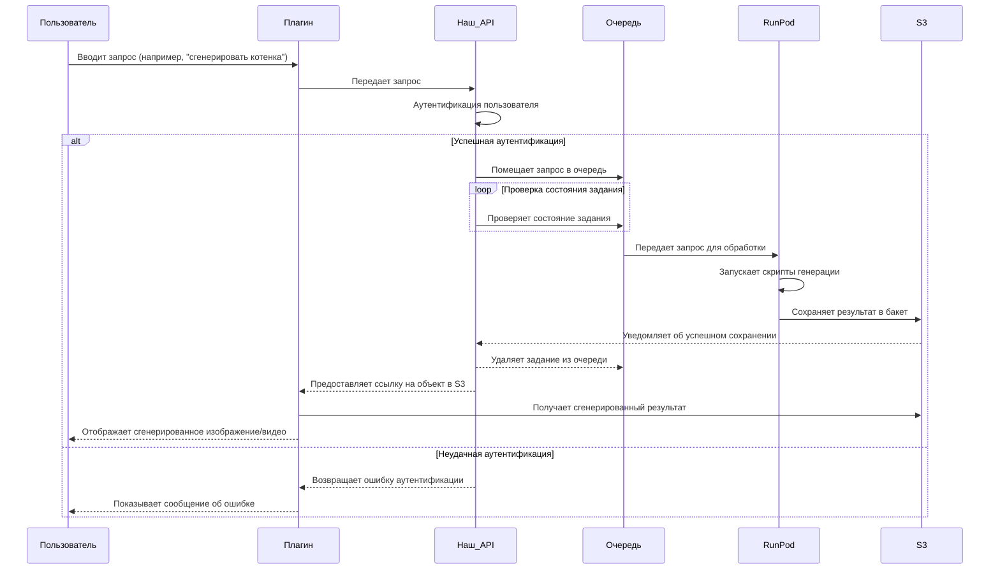

## The base scheme of the API logic

```mermaid
sequenceDiagram
    participant Пользователь
    participant Плагин
    participant Наш_API
    participant Очередь
    participant RunPod
    participant S3

    Пользователь->>Плагин: Вводит запрос (например, "сгенерировать котенка")
    Плагин->>Наш_API: Передает запрос
    Наш_API->>Наш_API: Аутентификация пользователя
    alt Успешная аутентификация
        Наш_API->>Очередь: Помещает запрос в очередь
        loop Проверка состояния задания
            Наш_API->>Очередь: Проверяет состояние задания
        end
        Очередь->>RunPod: Передает запрос для обработки
        RunPod->>RunPod: Запускает скрипты генерации
        RunPod->>S3: Сохраняет результат в бакет
        S3-->>Наш_API: Уведомляет об успешном сохранении
        Наш_API-->>Очередь: Удаляет задание из очереди
        Наш_API-->>Плагин: Предоставляет ссылку на объект в S3
        Плагин->>S3: Получает сгенерированный результат
        Плагин-->>Пользователь: Отображает сгенерированное изображение/видео
    else Неудачная аутентификация
        Наш_API-->>Плагин: Возвращает ошибку аутентификации
        Плагин-->>Пользователь: Показывает сообщение об ошибке
    end

```

## Try to use [https://mermaid.live/](https://mermaid.live/) as the more convinient tool to see mermaid scheme
