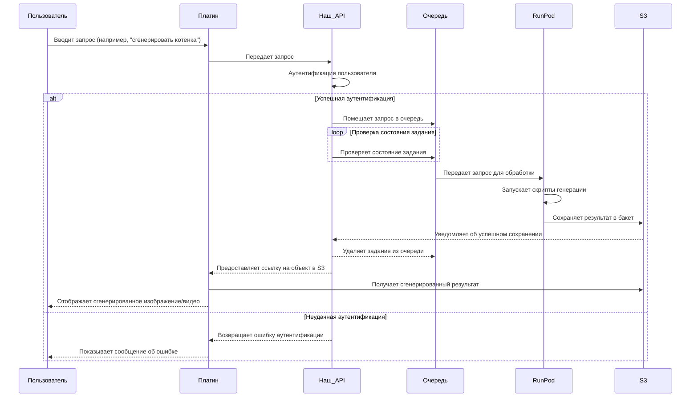
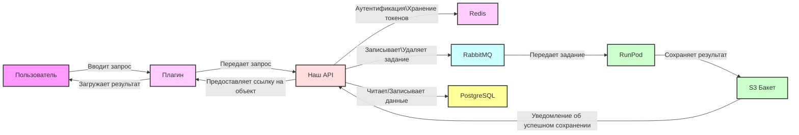

## The base scheme of the API logic

```mermaid
sequenceDiagram
    participant Пользователь
    participant Плагин
    participant Наш_API
    participant Очередь
    participant RunPod
    participant S3

    Пользователь->>Плагин: Вводит запрос (например, "сгенерировать котенка")
    Плагин->>Наш_API: Передает запрос
    Наш_API->>Наш_API: Аутентификация пользователя
    alt Успешная аутентификация
        Наш_API->>Очередь: Помещает запрос в очередь
        loop Проверка состояния задания
            Наш_API->>Очередь: Проверяет состояние задания
        end
        Очередь->>RunPod: Передает запрос для обработки
        RunPod->>RunPod: Запускает скрипты генерации
        RunPod->>S3: Сохраняет результат в бакет
        S3-->>Наш_API: Уведомляет об успешном сохранении
        Наш_API-->>Очередь: Удаляет задание из очереди
        Наш_API-->>Плагин: Предоставляет ссылку на объект в S3
        Плагин->>S3: Получает сгенерированный результат
        Плагин-->>Пользователь: Отображает сгенерированное изображение/видео
    else Неудачная аутентификация
        Наш_API-->>Плагин: Возвращает ошибку аутентификации
        Плагин-->>Пользователь: Показывает сообщение об ошибке
    end

```

The same logic in another point of view

```mermaid
graph LR
    A[Пользователь] -- Вводит запрос --> B[Плагин]
    B -- Передает запрос --> D[Наш API]
    D -- Аутентификация\Хранение токенов --> E[Redis]
    D -- Записывает\Удаляет задание --> F[RabbitMQ]
    F -- Передает задание --> G[RunPod]
    G -- Сохраняет результат --> H[S3 Бакет]
    D -- Читает/Записывает данные --> I[PostgreSQL]
    H -- Уведомление об успешном сохранении --> D
    D -- Предоставляет ссылку на объект --> B
    B -- Загружает результат --> A

    style A fill:#f9f,stroke:#333,stroke-width:2px
    style B fill:#fcf,stroke:#333,stroke-width:2px
    style D fill:#fdd,stroke:#333,stroke-width:2px
    style E fill:#fcf,stroke:#333,stroke-width:2px
    style F fill:#cff,stroke:#333,stroke-width:2px
    style G fill:#cfc,stroke:#333,stroke-width:2px
    style H fill:#cfc,stroke:#333,stroke-width:2px
    style I fill:#ff9,stroke:#333,stroke-width:2px
```

## Try to use [https://mermaid.live/](https://mermaid.live/) as the more convinient tool to see mermaid scheme
